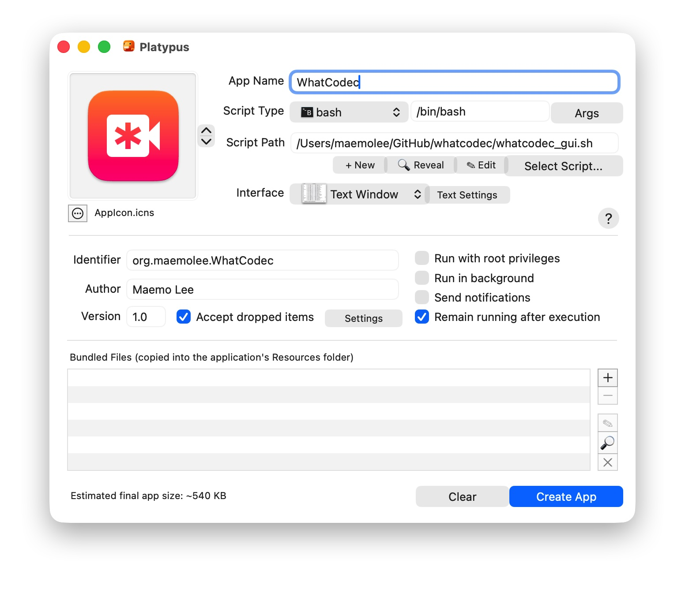

# whatcodec

一个简单的视频编码格式检测工具，支持本地文件和网络URL。

## 功能特性

- 🎞️ 检测各种视频编码格式（H.264、H.265、VP9、AV1等）
- 📁 支持本地文件分析
- 🌐 支持网络URL下载并分析
- 📡 支持直接分析URL（不下载文件）
- 🔍 特别支持FLV格式的codec_id识别

## 依赖要求

- `ffprobe` (通过 ffmpeg 提供)
- `curl`

## CLI 安装

1. 克隆项目：
```bash
git clone <repository-url> ~/Github/whatcodec
cd ~/Github/whatcodec
```

2. 运行安装脚本（仅安装命令行工具）：
```bash
./install.sh
```

3. 重新加载shell配置：
```bash
source ~/.zshrc
```

## 构建 macOS App

如果你希望获得通过拖拽文件使用的图形界面 App，可以使用 [Platypus](https://sveinbjorn.org/platypus) 进行封装。

**配置步骤：**

1. 确保已安装 Platypus。
2. 使用项目中的 `whatcodec_gui.sh` 作为 **Script Path**。
   - *注意：必须使用 `whatcodec_gui.sh` 而不是 `whatcodec`，前者包含了 GUI 环境下必要的环境变量修复和文件选择弹窗逻辑。*
3. 设置 **Interface** 为 **Text Window**。
4. **必须勾选** **Accept dropped items**。
5. 参考下图进行配置：



构建完成后，你可以直接将视频文件 **拖拽** 到 App 图标上，或者 **双击** App 在弹窗中选择文件进行分析。

## 使用方法

### 基本用法

```bash
# 分析本地文件
whatcodec video.mp4

# 分析网络视频（会下载临时文件）
whatcodec http://example.com/video.flv

# 直接分析URL（不下载文件）
whatcodec --direct http://example.com/video.m3u8

# 保留临时下载文件
whatcodec --keep http://example.com/video.flv
```

### 参数说明

- `--direct`: 直接分析URL，不下载文件到本地
- `--keep`: 保留下载的临时文件（用于调试）

### 支持的文件格式

- MP4, FLV, M3U8等常见视频格式
- 本地文件路径（绝对路径或相对路径）
- HTTP/HTTPS URL

### 输出示例

```bash
$ whatcodec video.mp4
📁 分析本地文件：video.mp4
🎞️ 编码类型：AVC (H.264)（codec_name=h264）

$ whatcodec http://example.com/stream.flv
⬇️ 下载视频：http://example.com/stream.flv
📁 分析本地文件：./temp_whatcodec_20231201120000.flv
🎞️ 编码类型：AVC (H.264)（codec_id=7）
```

## 卸载

删除安装的文件：
```bash
rm ~/.local/bin/whatcodec
```

如需要，从 `~/.zshrc` 中移除添加的PATH配置。

## 从原 .zshrc 迁移

如果你之前在 `.zshrc` 中有 `whatcodec` 函数，安装此工具后可以将原函数代码删除。新工具提供相同的功能但作为独立的可执行程序。